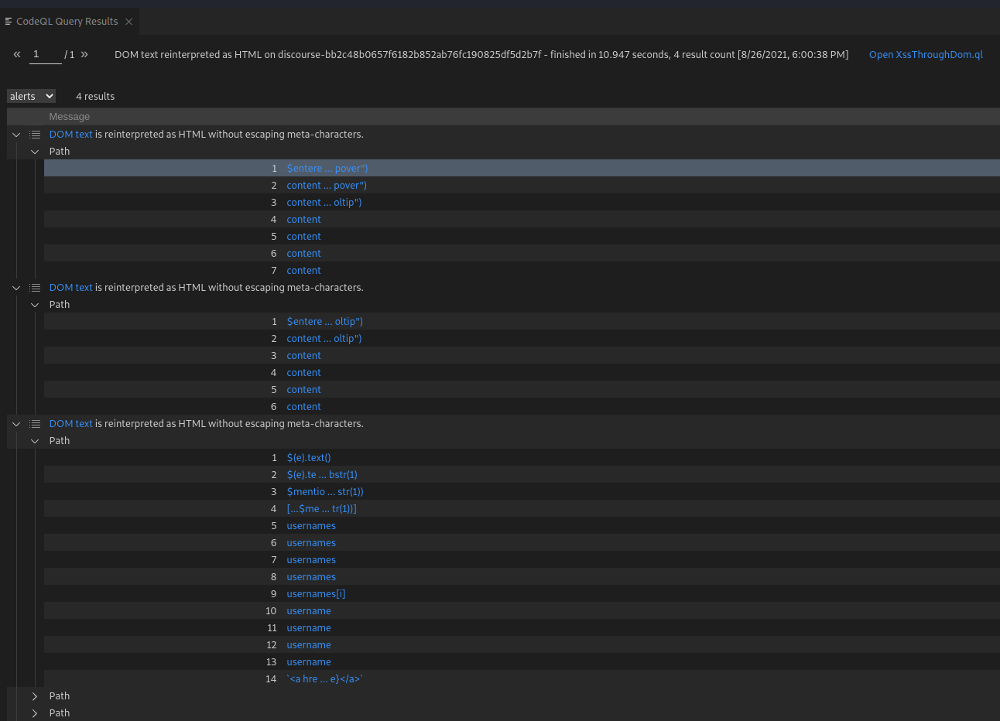

- An application is vulnerable to attack when:
	- User-supplied data is not validated, filtered, or sanitized by the application.
	- Dynamic queries or non-parameterized calls without context-aware escaping are used directly in the interpreter.
	- Hostile data is used within object-relational mapping (ORM) search parameters to extract additional, sensitive records.
	- Hostile data is directly used or concatenated. The SQL or command contains the structure and malicious data in dynamic queries, commands, or stored procedures.
- ## Actionables
	- Automated testing of all parameters, headers, URL, cookies, JSON, SOAP, and XML data inputs is strongly encouraged.
		- Discourse Sample
			- CodeQL Setup
			  ```
			  cd ~ &&\
			  mkdir codeQL && \
			  cd codeQL && \
			  mkdir databases && \
			  mkdir src && \
			  cd src && git clone https://github.com/discourse/discourse.git && \
			  cd discourse && \
			  git checkout bb2c48b0657f6182b852ab76fc190825df5d2b7f
			  LGTM_INDEX_FILTERS="include:*.js" codeql database create ../../databases/discourse - language=javascript
			  view raw
			  
			  ```
			- After the database is created it is possible to use the **_XssThroughDom.ql_** query to look for potential _DOM-based XSS_ vulnerabilities.
			  
			  If you set up your Visual Code+CodeQL integration you should get results that look like the following.
			  
- ## Resources
	- https://owasp.org/www-community/attacks/xss/
	- https://owasp.org/Top10/A03_2021-Injection/